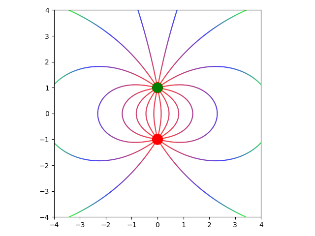
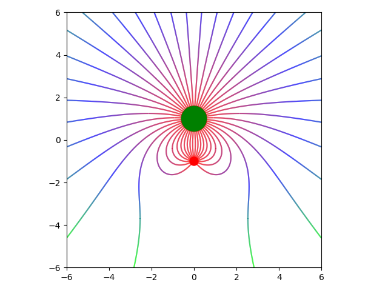
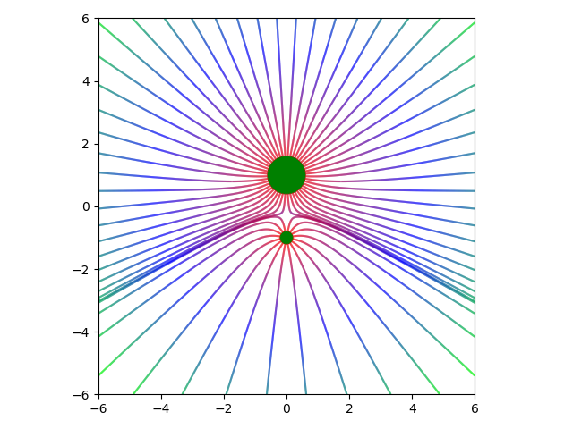
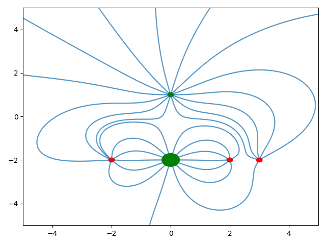

# Field Lines

This Python script generates electric or gravitational field lines as shown in the pictures below.

To make your own graph simply edit the `ITEMS` constant in `field_lines.py` to include your own charges. You may want to edit some of the other constants like `SIZE_OF_GRAPH` in `helper.py`.

